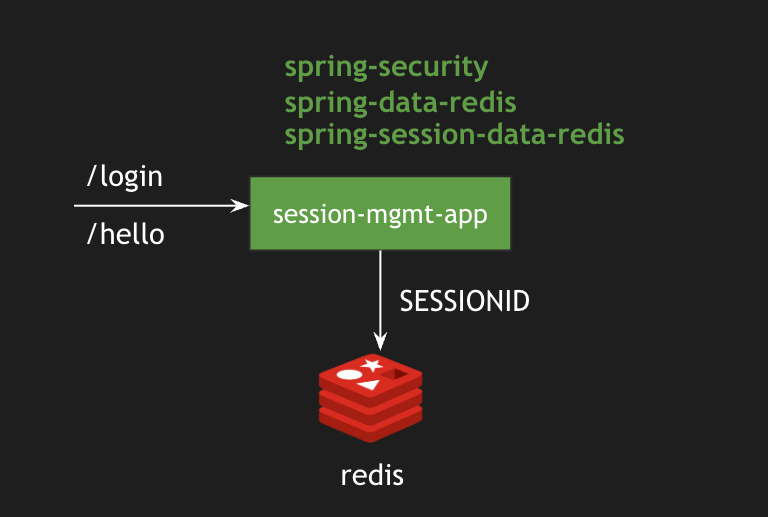

# Session Management using Spring Session Redis in Spring Boot
# install redis on wsl2 https://redis.io/docs/latest/operate/oss_and_stack/install/install-redis/install-redis-on-windows/
# editare il file /etc/redis/redis.conf impostare bind su 0.0.0.0 e  protected-mode no
## Architecture
